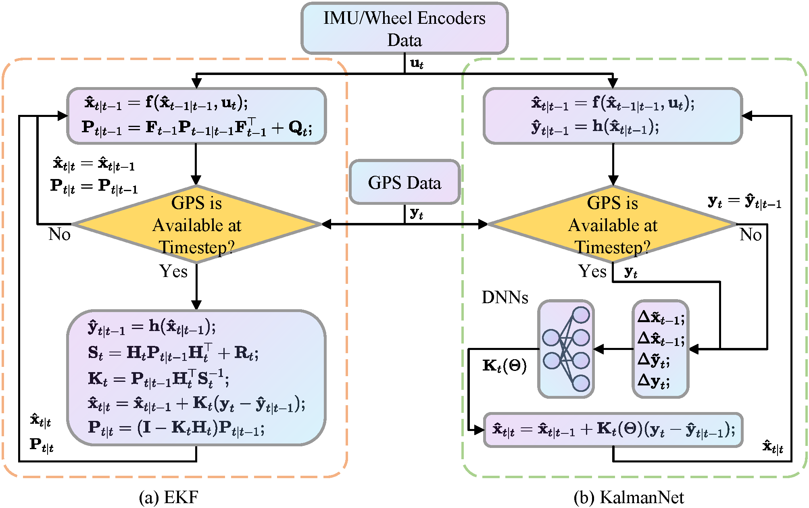

# Introduction
Practical Implementation of KalmanNet for Accurate Data Fusion in Integrated Navigation[[Paper]](https://ieeexplore.ieee.org/document/10605082)
1. Song, J., Mei, W., Xu, Y., Fu, Q. & Bu, L. Practical implementation of KalmanNet for accurate data fusion in integrated navigation. IEEE Signal Process. Lett. 1–5 (2024) doi:10.1109/LSP.2024.3431443.

## Citation

If you find the code useful, please consider citing our paper using the following BibTeX entry.
```latex
@ARTICLE{10605082,
  author={Song, Jian and Mei, Wei and Xu, Yunfeng and Fu, Qiang and Bu, Lina},
  journal={IEEE Signal Processing Letters}, 
  title={Practical Implementation of KalmanNet for Accurate Data Fusion in Integrated Navigation}, 
  year={2024},
  volume={},
  number={},
  pages={1-5},
  keywords={Training;Sensor fusion;Global Positioning System;Navigation;Vectors;Kalman filters;Wheels;Integrated navigation and localization;kalman filter;recurrent neural networks;sensor fusion},
  doi={10.1109/LSP.2024.3431443}}
```

## Flow Chart

## 2012-11-16 Result on Map


## Environment Setup
```
pip install -r requirements.txt
```

## Data Preprocessing
1. We have provided data in the `./data/NCLT/processed/` that has been preprocessed (consistent with the paper).
2. If you want to re-download the data and process it, use the following steps
```
# download sensor data and ground truth
python ./data/NCLT/down.py --sen 
python ./data/NCLT/down.py --gt 
ls ./data/NCLT/download/sensor_data/*.tar.gz | xargs -n1 tar xzvf
python ./data/NCLT/preprocess.py
```
## Train and Predict
1. Train.
```
# KalmanNet
python train.py --cfg ./configs/nclt/fusion/wheel_gpsfusion_origin.py
# Split KalmanNet
python train.py --cfg ./configs/nclt/fusion/wheel_gpsfusion_split.py
```
2. Inference.  
    Reference `nclt_predict.ipynb`

## Plotting on Map

We recommend using [QGIS](https://qgis.org/en/site/) for visualization on maps.
If you only want to see our results: 
    Using QGIS to open `./QGIS/20121116.qgz`.
Else if you want to plot your results:
1. Using the code provided at the bottom of `nclt_predict.ipynb`, the coordinates are converted and saved into kml (Code is modified from https://github.com/AbhinavA10/mte546-project).
2. Open QGIS and load vector(`xxx.kml`)


## Thanks

We are very grateful to the author of https://github.com/AbhinavA10/mte546-project which has inspired us a lot!